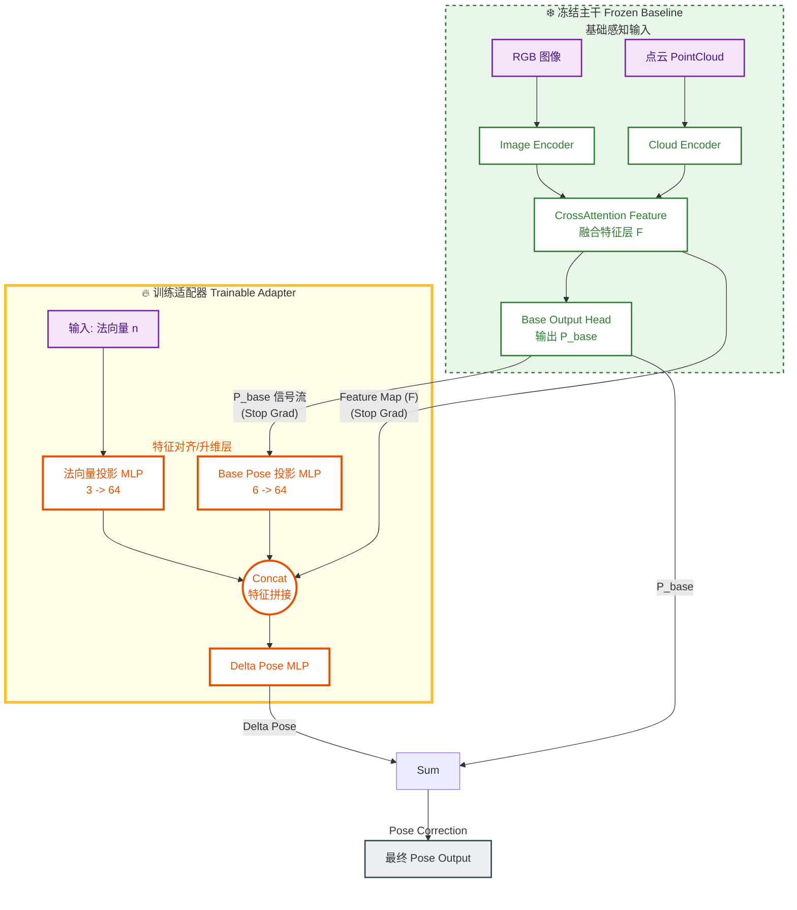

```mermaid
graph TD
    %% ================= 样式定义 =================
    %% 1. 冻结区 (Deep Green Style)
    classDef frozenNode fill:#ffffff,stroke:#2e7d32,stroke-width:2px,color:#2e7d32;
    
    %% 2. 训练区 (Deep Orange Style)
    classDef trainableNode fill:#ffffff,stroke:#e65100,stroke-width:3px,color:#e65100;
    
    %% 3. 输入节点 (Purple Style)
    classDef inputNode fill:#f3e5f5,stroke:#7b1fa2,stroke-width:2px,color:#4a148c;
    
    %% 4. 输出节点 (Grey Style)
    classDef outputNode fill:#eceff1,stroke:#37474f,stroke-width:2px;

    %% ================= 布局结构 =================
    
    %% ---------------- 左侧：冻结区域 ----------------
    subgraph LEFT_ZONE [❄️ 冻结主干 Frozen Baseline]
        direction TB
        
        subgraph INPUTS_L [基础感知输入]
            direction LR
            Img[RGB 图像]:::inputNode
            PC[点云 PointCloud]:::inputNode
        end

        ImgEnc[Image Encoder]:::frozenNode
        PCEnc[Cloud Encoder]:::frozenNode
        
        Fusion[CrossAttention Feature<br/>融合特征层 F]:::frozenNode
        
        BaseHead[Base Output Head<br/>输出 P_base]:::frozenNode
        
        %% 左侧连接
        Img --> ImgEnc
        PC --> PCEnc
        ImgEnc --> Fusion
        PCEnc --> Fusion
        Fusion --> BaseHead
    end

    %% ---------------- 右侧：训练区域 ----------------
    subgraph RIGHT_ZONE [🔥 训练适配器 Trainable Adapter]
        direction TB
        
        %% 1. 外部输入
        Normal[输入: 法向量 n]:::inputNode

        %% 2. 两个并行的 MLP 投影层 (直接接收原始数据)
        subgraph Embeddings [特征对齐/升维层]
            direction LR
            NormEmbed[法向量投影 MLP<br/>3 -> 64]:::trainableNode
            PoseEmbed[Base Pose 投影 MLP<br/>6 -> 64]:::trainableNode
        end
        
        %% 3. 唯一的汇聚点
        Concat((Concat<br/>特征拼接)):::trainableNode
        
        %% 4. 预测头
        DeltaNet[Delta Pose MLP]:::trainableNode
        
        %% 右侧连接
        Normal --> NormEmbed
        NormEmbed --> Concat
        PoseEmbed --> Concat
        Concat --> DeltaNet
    end

    %% ---------------- 底部：输出 ----------------
    subgraph OUTPUT_ZONE [Pose Correction]
        FinalOut[最终 Pose Output]:::outputNode
    end

    %% ================= 跨区域核心连接 (去重化) =================

    %% 1. 特征直接连 Concat
    Fusion --"Feature Map (F)<br/>(Stop Grad)"--> Concat

    %% 2. Base Pose 直接连 MLP (不做中间节点)
    BaseHead --"P_base 信号流<br/>(Stop Grad)"--> PoseEmbed

    %% 3. 最终加法
    BaseHead --"P_base"--> Sum
    DeltaNet --"Delta Pose"--> Sum
    Sum --> FinalOut

    %% ================= 区域背景 =================
    style LEFT_ZONE fill:#e8f5e9,stroke:#2e7d32,stroke-width:2px,stroke-dasharray: 5 5
    style RIGHT_ZONE fill:#fffde7,stroke:#fbc02d,stroke-width:4px
    
    %% 隐藏装饰性子图边框
    style INPUTS_L fill:none,stroke:none
    style Embeddings fill:none,stroke:none,color:#e65100
    style OUTPUT_ZONE fill:none,stroke:none
```