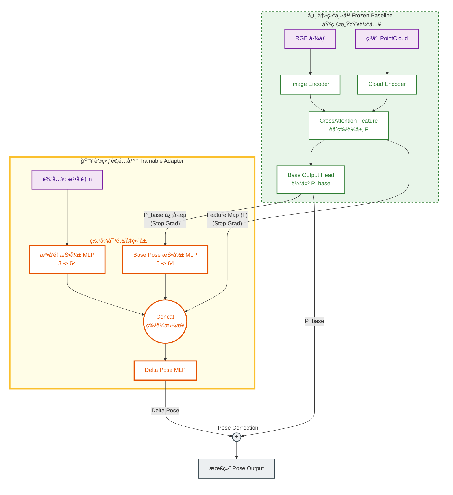

```mermaid
graph TB
    %% ================= æ ·å¼å®šä¹‰ (ä¸å˜) =================
    classDef frozenNode fill:#ffffff,stroke:#2e7d32,stroke-width:2px,color:#2e7d32;
    classDef trainableNode fill:#ffffff,stroke:#e65100,stroke-width:3px,color:#e65100;
    classDef inputNode fill:#f3e5f5,stroke:#7b1fa2,stroke-width:2px,color:#4a148c;
    classDef outputNode fill:#eceff1,stroke:#37474f,stroke-width:2px;

    %% ================= 顶层容器：用äºå¼ºåˆ¶å·¦å³å¹¶åˆ— =================
    subgraph MAIN_CONTAINER [ ]
        direction LR
        
        %% ---------------- 左侧：冻结区域 ----------------
        subgraph LEFT_ZONE [â„ï¸ å†»ç»“ä¸»å¹² Frozen Baseline]
            direction TB
            
            subgraph INPUTS_L [基础感知输入]
                direction LR
                Img[RGB 图åƒ]:::inputNode
                PC[点云 PointCloud]:::inputNode
            end

            ImgEnc[Image Encoder]:::frozenNode
            PCEnc[Cloud Encoder]:::frozenNode
            
            Fusion[CrossAttention Feature<br/>èåˆç‰¹å¾å±‚ F]:::frozenNode
            
            BaseHead[Base Output Head<br/>输出 P_base]:::frozenNode
            
            %% è¿æ¥
            Img --> ImgEnc
            PC --> PCEnc
            ImgEnc --> Fusion
            PCEnc --> Fusion
            Fusion --> BaseHead
        end

        %% ---------------- å³ä¾§ï¼šè®­ç»ƒåŒºåŸŸ ----------------
        subgraph RIGHT_ZONE [🔥 训练适é…器 Trainable Adapter]
            direction TB
            
            %% 外部输入
            Normal[输入: 法å‘é‡ n]:::inputNode

            %% 并行投影层
            subgraph Embeddings [特å¾å¯¹é½/å‡ç»´å±‚]
                direction LR
                NormEmbed[法å‘é‡æŠ•å½± MLP<br/>3 -> 64]:::trainableNode
                PoseEmbed[Base Pose 投影 MLP<br/>6 -> 64]:::trainableNode
            end
            
            %% 汇èšä¸é¢„测
            Concat((Concat<br/>特å¾æ‹¼æ¥)):::trainableNode
            DeltaNet[Delta Pose MLP]:::trainableNode
            
            %% è¿æ¥
            Normal --> NormEmbed
            NormEmbed --> Concat
            PoseEmbed --> Concat
            Concat --> DeltaNet
        end
    end

    %% ---------------- 底部：全局输出 (在容器外) ----------------
    subgraph OUTPUT_ZONE [Pose Correction]
        Sum((+)):::outputNode
        FinalOut[最终 Pose Output]:::outputNode
    end

    %% ================= 跨区域核心è¿æ¥ =================

    %% 1. 特å¾å›¾è·¨è¶Š (ä»å·¦åˆ°å³)
    Fusion --"Feature Map (F)<br/>(Stop Grad)"--> Concat

    %% 2. Base Pose 跨越 (ä»å·¦åˆ°å³)
    BaseHead --"P_base ä¿¡å·æµ<br/>(Stop Grad)"--> PoseEmbed

    %% 3. 结æœæ±‡èš (å‘下)
    BaseHead --"P_base"--> Sum
    DeltaNet --"Delta Pose"--> Sum
    Sum --> FinalOut

    %% ================= æ ·å¼è®¾ç½® =================
    %% éšè—最外层容器边框
    style MAIN_CONTAINER fill:none,stroke:none

    %% 区域颜色
    style LEFT_ZONE fill:#e8f5e9,stroke:#2e7d32,stroke-width:2px,stroke-dasharray: 5 5
    style RIGHT_ZONE fill:#fffde7,stroke:#fbc02d,stroke-width:4px
    
    %% éšè—装饰性å­å›¾
    style INPUTS_L fill:none,stroke:none
    style Embeddings fill:none,stroke:none,color:#e65100
    style OUTPUT_ZONE fill:none,stroke:none
```