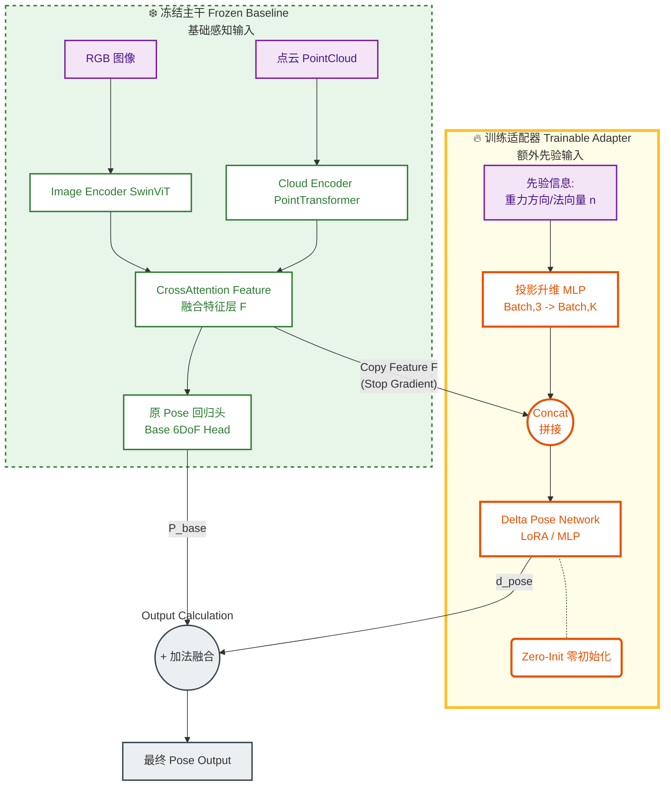

```mermaid

graph TD
    %% ================= 样式定义 =================
    %% 1. 冻结区节点样式 (深绿边框，浅白绿底)
    classDef frozenNode fill:#ffffff,stroke:#2e7d32,stroke-width:2px,color:#2e7d32;
    
    %% 2. 训练区节点样式 (深橘边框，强对接色)
    classDef trainableNode fill:#ffffff,stroke:#e65100,stroke-width:3px,color:#e65100;
    
    %% 3. 输入节点样式 (紫色)
    classDef inputNode fill:#f3e5f5,stroke:#7b1fa2,stroke-width:2px,color:#4a148c;
    
    %% 4. 输出节点样式 (灰色/通用)
    classDef outputNode fill:#eceff1,stroke:#37474f,stroke-width:2px;

    %% ================= 布局结构 =================
    
    %% ---------------- 左侧：冻结区域 (背景设置为绿色) ----------------
    subgraph LEFT_ZONE [❄️ 冻结主干 Frozen Baseline]
        direction TB
        
        subgraph INPUTS_L [基础感知输入]
            direction LR
            Img[RGB 图像]:::inputNode
            PC[点云 PointCloud]:::inputNode
        end

        ImgEnc[Image Encoder SwinViT]:::frozenNode
        PCEnc[Cloud Encoder PointTransformer]:::frozenNode
        
        Fusion[CrossAttention Feature<br/>融合特征层 F]:::frozenNode
        
        BaseHead[原 Pose 回归头<br/>Base 6DoF Head]:::frozenNode
        
        %% 内部连接
        Img --> ImgEnc
        PC --> PCEnc
        ImgEnc --> Fusion
        PCEnc --> Fusion
        Fusion --> BaseHead
    end

    %% ---------------- 右侧：训练区域 (背景设置为黄色) ----------------
    subgraph RIGHT_ZONE [🔥 训练适配器 Trainable Adapter]
        direction TB
        
        subgraph INPUTS_R [额外先验输入]
            Normal[先验信息: <br/>重力方向/法向量 n]:::inputNode
        end

        %% 你的方案1：投影升维
        ProjectMLP[投影升维 MLP<br/>Batch,3 -> Batch,K]:::trainableNode
        
        %% 拼接操作
        Concat((Concat<br/>拼接)):::trainableNode
        
        DeltaNet[Delta Pose Network<br/>LoRA / MLP]:::trainableNode
        
        ZeroInit(Zero-Init 零初始化):::trainableNode
        
        %% 内部连接
        Normal --> ProjectMLP
        ProjectMLP --> Concat
        Concat --> DeltaNet
        DeltaNet -.- ZeroInit
    end

    %% ---------------- 底部：最终输出 ----------------
    subgraph OUTPUT_ZONE [Output Calculation]
        Sum((+ 加法融合)):::outputNode
        FinalOut[最终 Pose Output]:::outputNode
    end

    %% ================= 跨区域连接 =================

    %% 核心连接：从左侧特征层 -> 复制一份 -> 连到右侧拼接点
    Fusion --"Copy Feature F<br/>(Stop Gradient)"--> Concat

    %% 头部输出连接
    BaseHead --P_base--> Sum
    DeltaNet --d_pose--> Sum
    Sum --> FinalOut

    %% ================= 区域背景着色 (关键步骤) =================
    %% 左侧区域背景：浅绿色 #e8f5e9
    style LEFT_ZONE fill:#e8f5e9,stroke:#2e7d32,stroke-width:2px,stroke-dasharray: 5 5
    
    %% 右侧区域背景：浅黄色 #fffde7
    style RIGHT_ZONE fill:#fffde7,stroke:#fbc02d,stroke-width:4px
    
    %% 隐藏输入子图的边框，为了好看
    style INPUTS_L fill:none,stroke:none
    style INPUTS_R fill:none,stroke:none
    style OUTPUT_ZONE fill:none,stroke:none

```