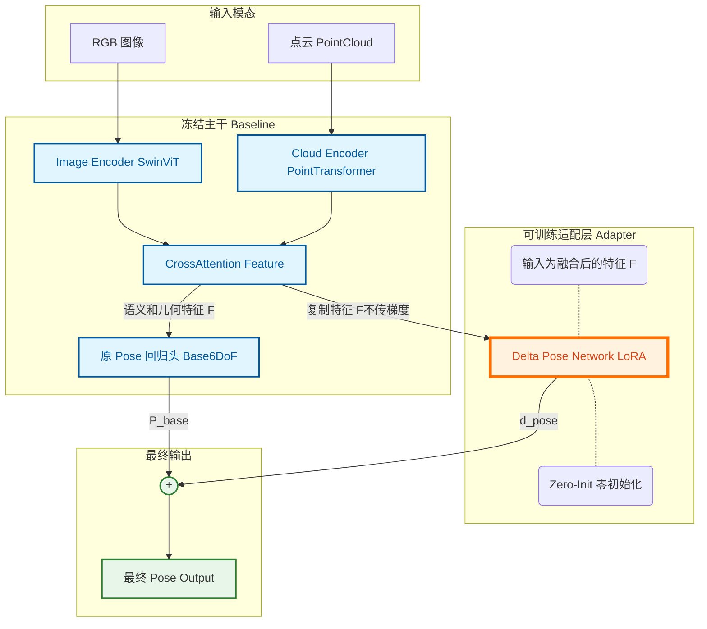

```mermaid
graph TD
    %% 定义样式
    classDef frozen fill:#e1f5fe,stroke:#01579b,stroke-width:2px,color:#01579b;
    classDef trainable fill:#fff3e0,stroke:#ff6f00,stroke-width:4px,color:#d84315;
    classDef output fill:#e8f5e9,stroke:#2e7d32,stroke-width:2px;

    %% ---------------- 输入部分 ----------------
    subgraph INPUTS [输入模态]
        direction LR
        Img[RGB 图像]
        PC[点云 PointCloud]
    end

    %% ---------------- 冻结的主干 ----------------
    subgraph FROZEN_BACKBONE [冻结主干 Baseline]
        direction TB
        ImgEnc[Image Encoder SwinViT]:::frozen
        PCEnc[Cloud Encoder PointTransformer]:::frozen
        
        Fusion[CrossAttention Feature]:::frozen
        
        BaseHead[原 Pose 回归头 Base6DoF]:::frozen
    end

    %% ---------------- 可训练的分支 ----------------
    subgraph TRAINABLE_MODULE [可训练适配层 Adapter]
        direction TB
        note1(输入为融合后的特征 F)
        
        DeltaNet[Delta Pose Network LoRA]:::trainable
        
        note2(Zero-Init 零初始化)
    end

    %% ---------------- 融合与输出 ----------------
    subgraph FUSION [最终输出]
        Sum((+)):::output
        FinalOut[最终 Pose Output]:::output
    end

    %% ---------------- 连线逻辑 ----------------
    Img --> ImgEnc
    PC --> PCEnc

    ImgEnc --> Fusion
    PCEnc --> Fusion

    %% 连线注释写在竖线中间最稳妥
    Fusion --语义和几何特征 F--> BaseHead
    Fusion --复制特征 F不传梯度--> DeltaNet

    %% 输出计算
    BaseHead --P_base--> Sum
    DeltaNet --d_pose--> Sum
    
    Sum --> FinalOut
    
    %% 布局调整连接
    note1 -.- DeltaNet
    DeltaNet -.- note2
```